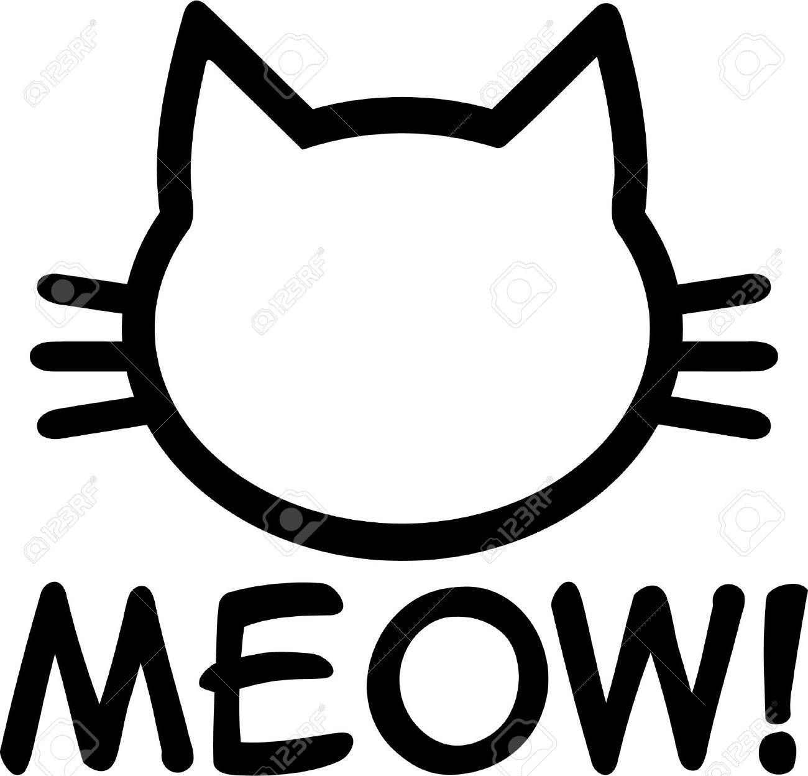
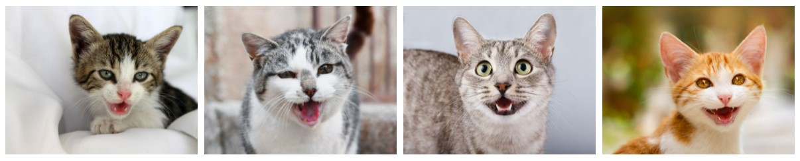

##  Cat Vocalizations Classification by Meow_Net



Cat vocalizations are their basic means of communication. They are particularly important in assessing their welfare status since they are indicative of information associated with the environment they were produced, the animal’s emotional state, etc.

In this study, we try to use MFCC (Mel-Frequency Cepstrum) to extract the feature of cat vocalizations. Then we use **Meow-Net** to train the model for cat vocalizations classificatioin.

The data comes from the Cat Vocalizations Dataset [CatMeows](https://zenodo.org/record/4008297), which contains the sounds of Maine Coon and European Shorthair breeds emitted in three different contexts, namely waiting for food, isolation in unfamiliar environment, and brushing.

The obtained results are excellent, rendering the proposed framework particularly useful towards a better understanding of the acoustic communication between humans and cats.




## Code

### Install dependencies

```
python -m pip install -r requirements.txt
```

This code was tested with python 3.7  

###  Train
This script is based on CatMeows as an example. For training, please run:

```
python TestRun.py
```

## Script Introduction

```Meow_Proliferate.py``` is used to generate more feature maps.

```Meow_Attention.py``` is used to capturing the long-range dependencies of the feature map.

```Meow_Proliferate_and_Attention.py``` follow the spirit of MobileNet,  "capture features in high dimensions and transfer information in low dimensions",  to make the network more efficient.

```Meow_Net.py``` is the overall network architecture of **Meow-Net**.

```CircleLoss.py``` is used to estimate the loss rate during model training with two elemental deep feature learning approaches: class-level labels and pair-wise labels.

```Meow_SPA.ipynb``` is in the form of a Jupyter Notebook as a simple display with [CatMeows](https://zenodo.org/record/4008297) as the training object.
